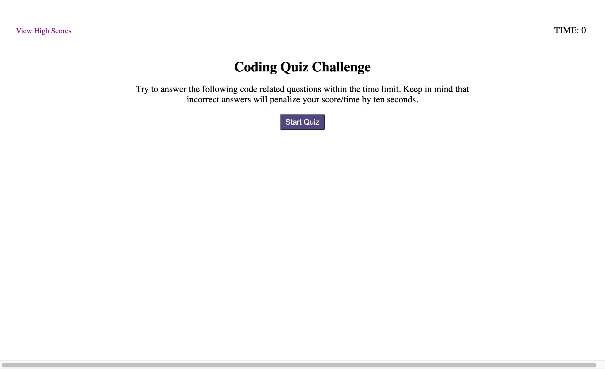
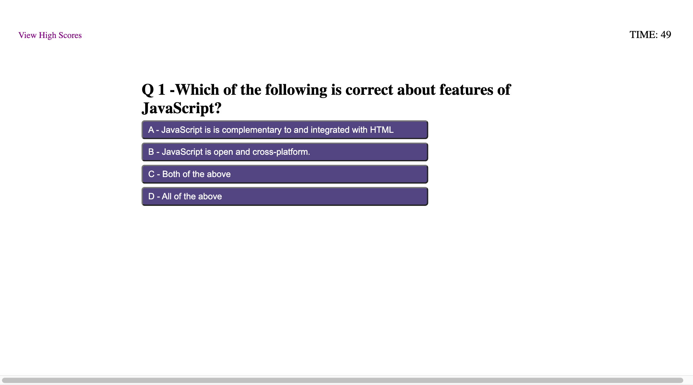
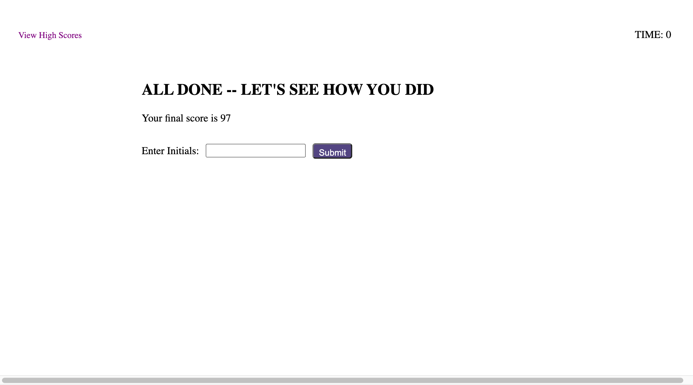
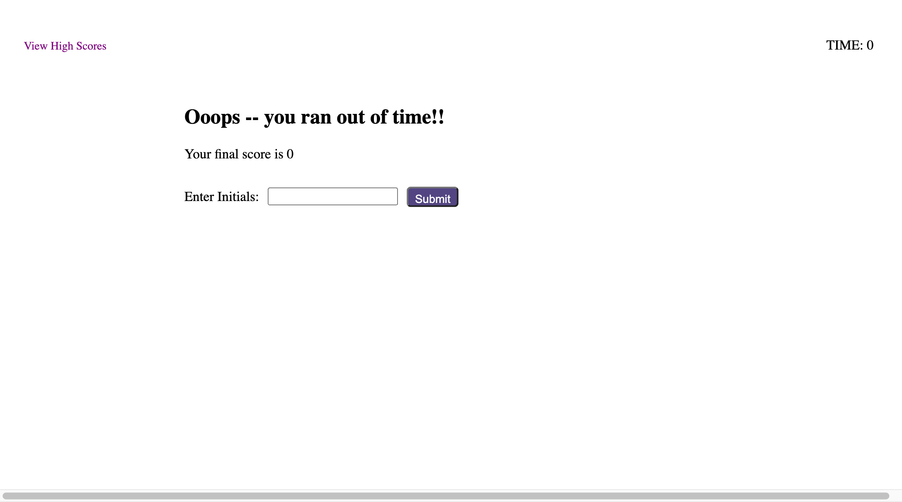
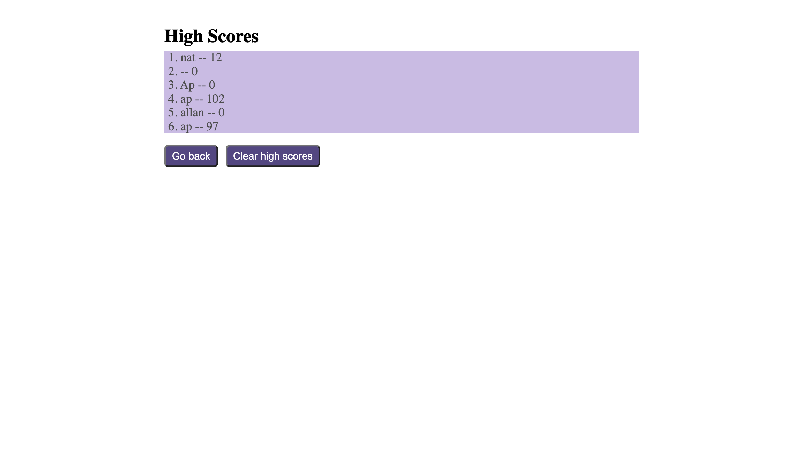

# 04-code-quiz
A code quiz challenge using Web APIs 

## About 

The code quiz application is an awesome challenge of vanilla JavaScript that challenges you to think both outside and inside the box. Some of the concepts that were heavily used throught are: 

- Creating html elements using the DOM
- adding event listeners to buttons
- adding event listeners to future html elements
- delegating event listeners using event.target and listening for classNames
- setInterval / clearInterval
- setTimeout / clearTimeout
- localStorage 
- flexbox (even though i did not add optimization for different screen sizes)
- using functions to reduce code that would be repeated (could be optimized more)


---


## User Story

```
* AS A coding boot camp student
* I WANT to take a timed quiz on JavaScript fundamentals that stores high scores
* SO THAT I can gauge my progress compared to my peers
```

## Acceptance Criteria

```
* GIVEN I am taking a code quiz
* WHEN I click the start button
* THEN a timer starts and I am presented with a question
* WHEN I answer a question
* THEN I am presented with another question
* WHEN I answer a question incorrectly
* THEN time is subtracted from the clock
* WHEN all questions are answered or the timer reaches 0
* THEN the game is over
* WHEN the game is over
* THEN I can save my initials and score
```

---

## Screenshots



---



---



---



---



---


## Link to Deployed Application

https://allanp94.github.io/04-code-quiz/


